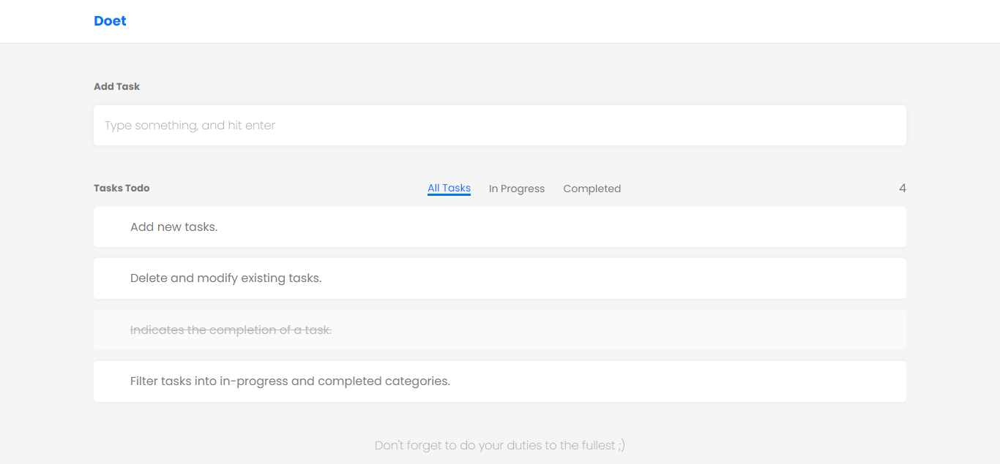
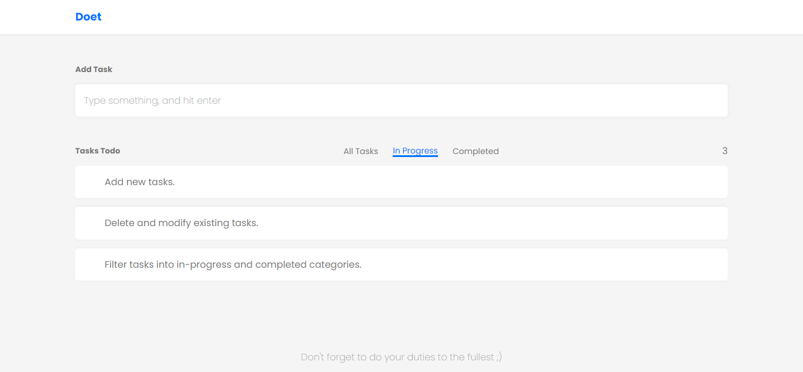
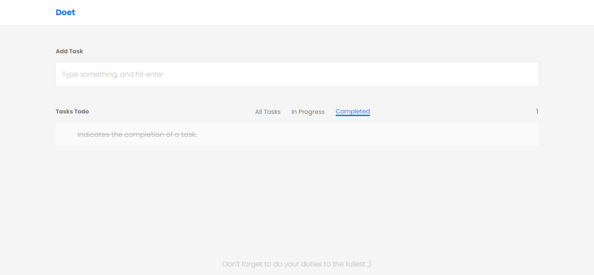
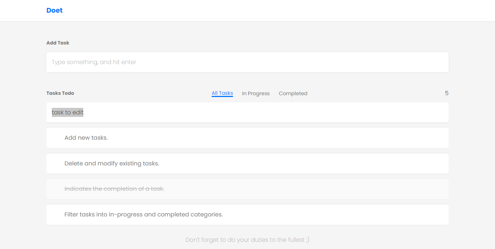
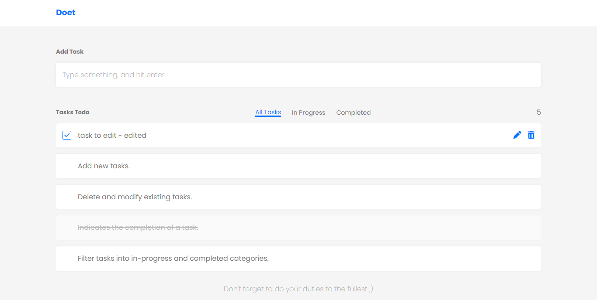
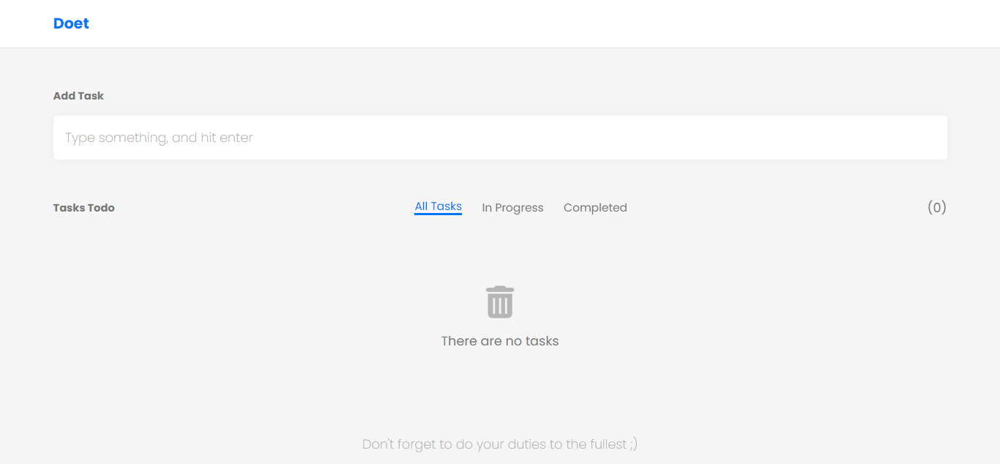
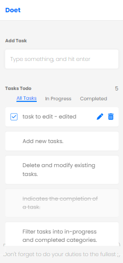

# Doet
This repository is a todo application developed using HTML, CSS, and vanilla JavaScript.

This app offers several features:
- Add new tasks.
- Delete existing tasks.
- Modify existing tasks.
- Indicates the completion of a task.
- Filter tasks into in-progress and completed categories.

This app uses localstorage API to store tasks' data

## Live Previwe
[Github Pages](https://alialhussein.ml/doet-app)

## Credits
* Free Google font [Poppins](https://fonts.google.com/specimen/Poppins)

